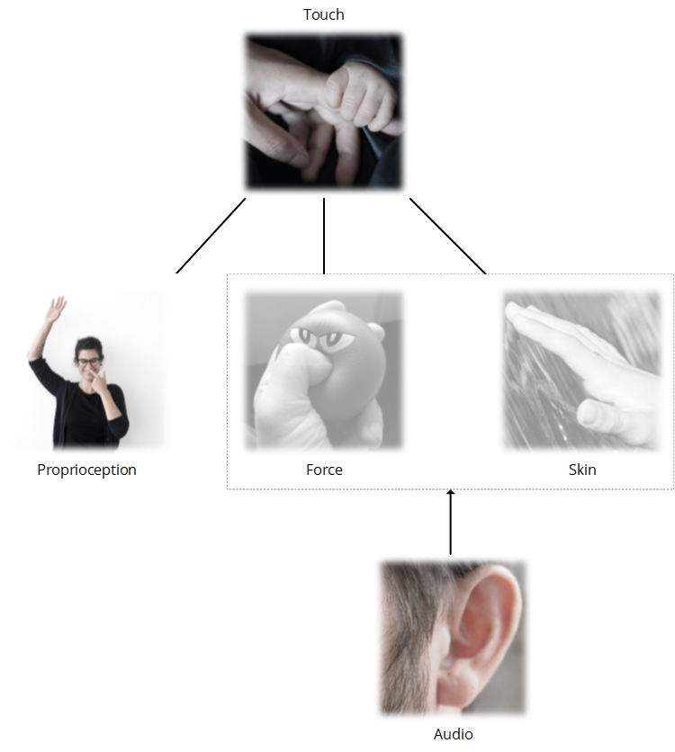
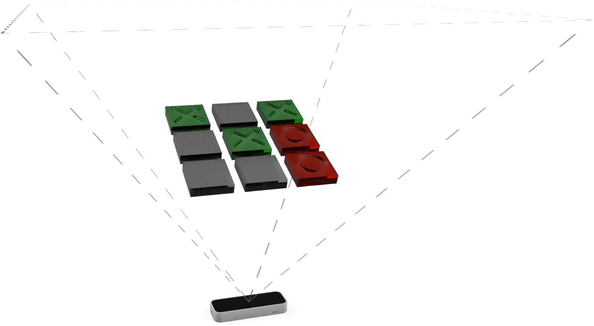

# "Tic-tac-tone"

This repository contains experimental code for a non-visual tic-tac-toe implementation, made as a proof-of-concept "audio-proprioceptive user interface."

Audio-proprioceptive user interfaces are a class of user interfaces (UIs) that make extensive and exclusive use of sound as a feedback modality for mid-air gestural interaction. They can be considered as a type of auditory display, coupled to mid-air gesture sensing. In essence, audio-proprioceptive user interfaces substitute audio in lieu of force and cutaneous sensations.

The audio-proprioceptive tic-tac-toe game prototype implemented using a tabletop hand gesture sensing device can be visualized as below. (Note that the actual experience does not involve graphics.)

